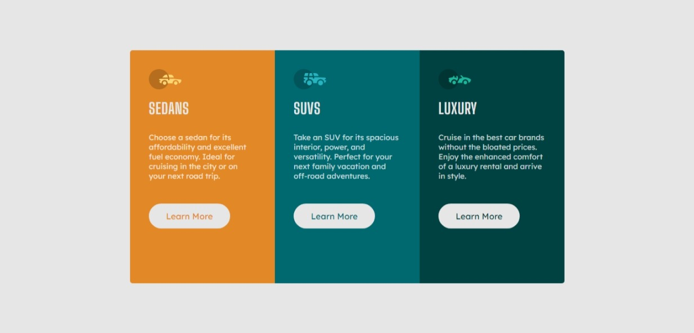
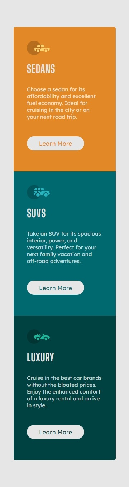

# Frontend Mentor - 3-column preview card component

## Welcome! 👋

Thanks for checking out this front-end coding challenge.

## Table of contents

- [Overview](#overview)
  - [The challenge](#the-challenge)
  - [Screenshot](#screenshot)
  - [Links](#links)
- [Built with](#built-with)

## Overview

### The challenge

build 3-column preview card component and get it looking as close to the design as possible and be responsive to bothh mobile screen and desktop screen.

### Screenshot
Descktop screen

Mobile screen

### Links

- Solution URL: [Add solution URL here](https://your-solution-url.com)
- Live Site URL: [Add live site URL here](https://your-live-site-url.com)

### Built with
- Semantic HTML5 markup
- CSS custom properties
- Flexbox

## Got feedback for me?

I appriciate your feedback! I'm always looking to improve my skills and maybe your point changed mine. So if you have anything you'd like to mention, send a comment on the challenge page or open an issue.

