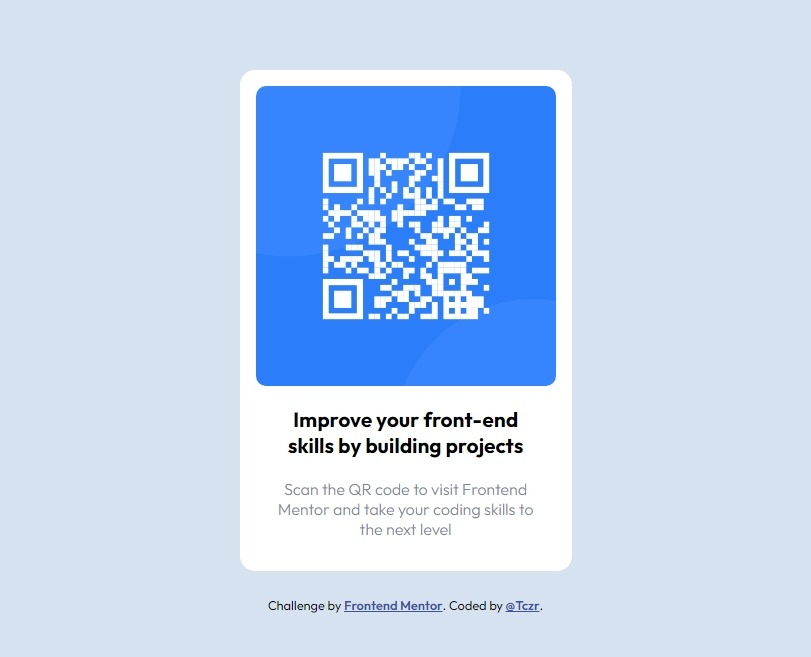

# Frontend Mentor - QR code component solution

This is a solution to the [QR code component challenge on Frontend Mentor](https://www.frontendmentor.io/challenges/qr-code-component-iux_sIO_H). Frontend Mentor challenges. 
## Table of contents

- [Overview](#overview)
  - [Screenshot](#screenshot)
  - [Links](#links)
- [My process](#my-process)
  - [Built with](#built-with)
  - [What I learned](#what-i-learned)
- [Author](#author)
- [Acknowledgments](#acknowledgments)


## Overview
build out QR code component and get it looking as close to the design as possible. [FrontendMentor](https://www.frontendmentor.io) website.

### Screenshot

 Desktop


 Phone


### Links

- Solution URL: [My solution on FrontEnd Mentor website](https://www.frontendmentor.io/profile/Tczr)
- Live Site URL: [Live here](https://your-live-site-url.com)

## My process
1. I looked at the design and thought about the structure.
2. create html file and structured as I thought of it.
3. link the matiral such as fonts, css files, icons.
4. styling the components based on guessing the values of width and paddings and margins to match the design.
### Built with

- Semantic HTML5 markup
- CSS custom properties
- Flexbox
- Mobile-first workflow

### What I learned
I learnd on this project how can simple and good desgin deffer from complex css and bad desgin.
Also I learned a technique to center conenet both side vertically and horizontally with `flex box`.
I could have used `margin: 15% auto;` OR something like that but, doing this could make the page taller and it will be anoying to scroll up and down to view the hole content 

```html
<body>..

</body>
```
```css
body {
    display:flex;
    flex-direction: column;
    justify-content: center;
    align-items: center;
}
```
[see line 19 in [main.css] file inside [/styles] folder](./styles/main.css).

## Author
- Frontend Mentor - [@Tczr](https://www.frontendmentor.io/profile/Tczr)

